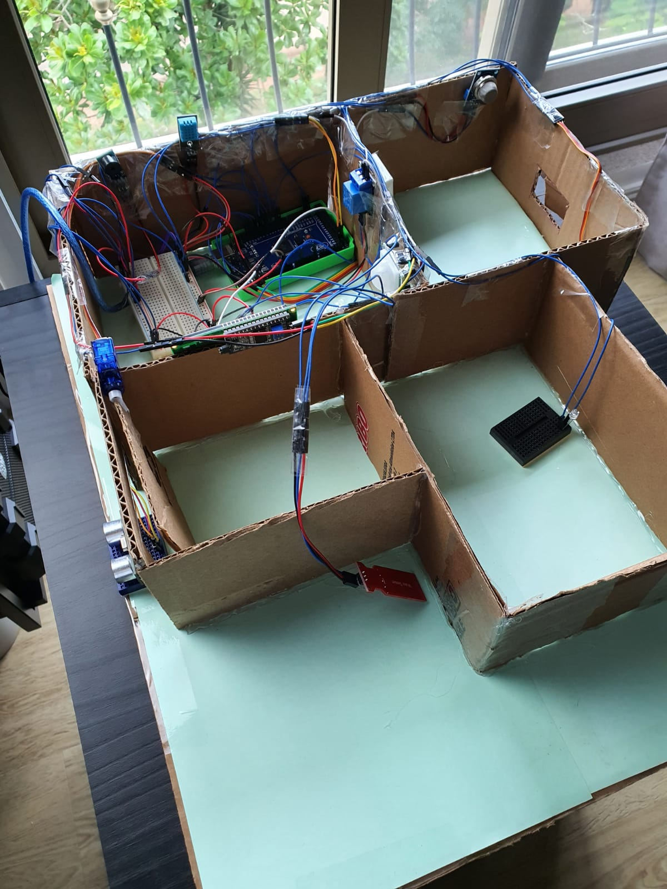
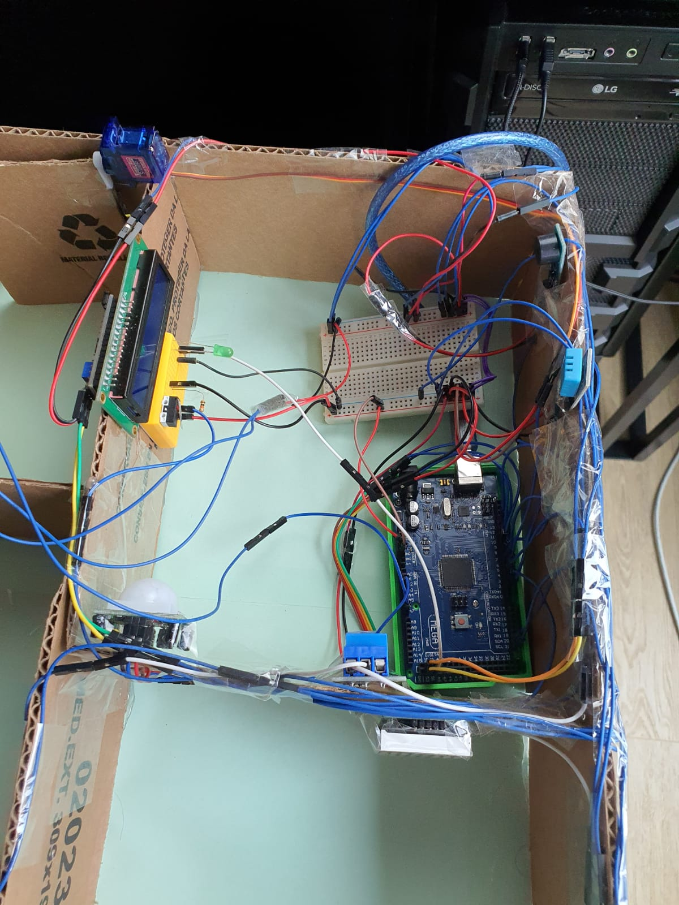
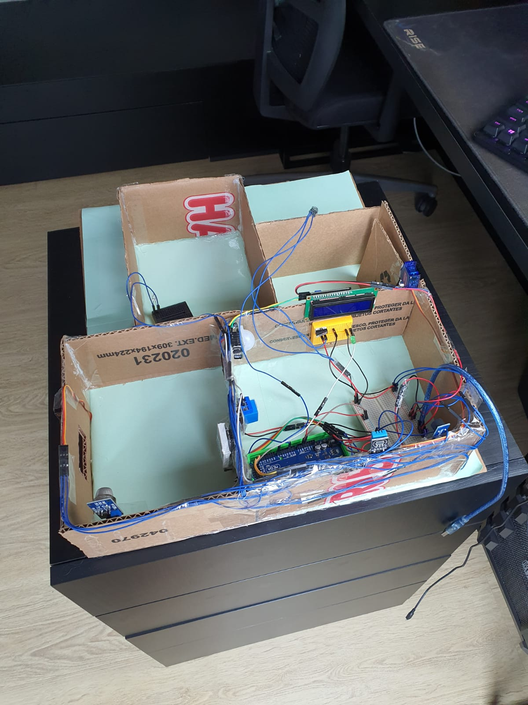

# Implementação

Para demonstrar tudo que foi discutido na disgne do projeto foi realizado um protótipo da maquete apartir dos componentes mencionados que foram programadaos na interface do arduino, todos os ajustes foram feitos para que tudo funcionace como esperado.

Para realizar a construção do protótipo foi realizado testes com cada componente com intuito de confirmar o funcionamento além de entender como cada módulo fuionava. Após os testes de cada módulo foi realizada a programação de cada funcionalidade descrita anteriormente de forma separada.

- [Alarme de segurança](Funcionalidade_Alarme.md)
- [Sensor de visitas no portão](Funcionalidade_Portao.md)
- [Sensor de gás na cozinha](Funcionalidade_Gas.md)
- [Sensor de temperatura](Funcionalidade_Temp.md)
- [Sensor de nível de água](Funcionalidade_Agua.md)

As imagens a seguir mostram como o protótipo foi montado





Código utilizado para realizar todas as funcionalidades ao mesmo tempo:

```C

#include <Servo.h>
#include <Ultrasonic.h>
#include <LiquidCrystal_I2C.h>
#include <LedControl.h>
#include <DHT.h> 

//define os parametros do lcd
LiquidCrystal_I2C lcd(0x27, 16, 2);
//definindo a Matriz de led como lc
LedControl lc = LedControl(10, 12, 11, 1);

#define buzzer            8
#define pir               7
#define SERVOPIN          6
#define pino_trigger      52
#define pino_echo         53
#define JANELAPIN         5
#define DHT11PIN          2
#define RELE              13
#define LED               51
#define DHTTYPE           DHT11
#define ENTRADA_GAS       A2
#define PINO_SENSOR_AGUA  A7

Servo PORTAO;
Servo JANELA;
Ultrasonic ultrasonic(pino_trigger, pino_echo);
DHT dht(DHT11PIN, DHTTYPE);


int botao = 3;
int pressionado = 0;

bool ligar_alarme = false;
bool ligar_alarme_gas = false;

//variáveis para o alarme de segurança
int screenOffMsg =  0;
int valuePIR;
bool enteredPassword;
bool activated = false;              // estado do alarme para o sistema de segurança
bool isActivated;
bool activateAlarm = false;
bool alarmActivated = false;
unsigned long ultimociclo = millis();   //variaveis para determinar os tempos de espera do alarme
unsigned long ultimociclo2 = millis();  //variaveis para determinar os tempos de espera do alarme
unsigned long periodo = 1000;           //variaveis para determinar os tempos de espera do alarme

//variáveis para o sensor de visitas
int posp = 0;                           //guarda a posição do servo do portao
int estado_alarme = LOW;
bool abre_portao = false;
long distancia;
const unsigned long periodo_tarefa_1 = 500;
unsigned long tempo_tarefa_1 = 0;

//variáveis para o sensor de gas
int posj = 10;                           //guarda a posição do servo da janela
int estado_alarme_gas = LOW;
int aSensor;
const unsigned long periodo_tarefa_2 = 1000;
unsigned long tempo_tarefa_2 = millis();
byte ALL[] = {B11111111, B11111111, B11111111, B11111111, B11111111, B11111111, B11111111, B11111111}; //a matriz "ALL" tem os leds da matriz a serem ligados, no caso todos
bool ligar_matriz = false;
bool msg_gas = false;
bool abre_janela = false;

//variáveis para o sensor de temperatura
const unsigned long periodo_tarefa_temp = 1000;
unsigned long tempo_tarefa_temp = millis();

//variáveis para o sensor de água

const unsigned long periodo_tarefa_agua = 1000;
unsigned long tempo_tarefa_agua = millis();


void setup() {
  Serial.begin(9600);
  dht.begin();
  PORTAO.attach(SERVOPIN);
  JANELA.attach(JANELAPIN);
  lcd.init();       // INICIA A COMUNICAÇÃO COM O DISPLAY
  lcd.backlight();  // LIGA A ILUMINAÇÃO DO DISPLAY
  lcd.clear();      // LIMPA O DISPLAY
  pinMode (buzzer, OUTPUT);
  pinMode (LED, OUTPUT);
  pinMode (pir, INPUT);
  pinMode (botao, INPUT);
  pinMode (RELE, OUTPUT);
  digitalWrite(buzzer, HIGH);
  //comandos da matriz de led
  lc.shutdown(0, false);  //inicializa a matriz de led
  lc.setIntensity(0, 8);  //defini a intensidade
  lc.clearDisplay(0);     //limpa os dados da matriz
}

void loop() {
  //alarme de segurança
  tarefa_alarme_seguranca();
  //buzzer
  tarefa_buzzer();
  //serial
  tarefa_serial();
  //sistema da visita
  tarefa_portao();
  tarefa_visita_portao();
  //tarefas sensor de gas
  tarefa_janela();
  tarefa_matriz();
  tarefa_gas();
  //tarefa sensor de temp
  tarefa_temp();
  //tarefa sensor de agua
  tarefa_agua();

}

void tarefa_alarme_seguranca() {

  if (activateAlarm) {
    lcd.clear();
    lcd.setCursor(0, 0);
    lcd.print("Alarm will be");
    lcd.setCursor(0, 1);
    lcd.print("activated in");


    int countdown = 9; // 9 seconds count down before activating the alarm
    while (countdown != 0) {
      unsigned long tempoagora = millis();
      if (tempoagora - ultimociclo > periodo) {
        ultimociclo = tempoagora;

        lcd.setCursor(13, 1);
        lcd.print(countdown);
        countdown--;
      }
    }
    lcd.clear();
    lcd.setCursor(0, 0);
    lcd.print("Alarm Activated!");
    activateAlarm = false;
    alarmActivated = true;
  }

  if (alarmActivated == true) {
    valuePIR = digitalRead(pir);
    if ( valuePIR == HIGH) {
      digitalWrite(buzzer, LOW);
      lcd.clear();
      enterPassword();
    }
    pressionado = digitalRead (botao);
    if ( pressionado == HIGH) {
      lcd.setCursor(0, 0);
      lcd.print("Deactivating...");

      int countdown2 = 2;
      while (countdown2 != 0) {
        unsigned long tempoagora2 = millis();
        if (tempoagora2 - ultimociclo2 > periodo) {
          ultimociclo2 = tempoagora2;

          activated = false;
          alarmActivated = false;
          digitalWrite(buzzer, HIGH);
          screenOffMsg = 0;
          countdown2--;
        }
      }

    }
  }

  if (!alarmActivated) {
    if (screenOffMsg == 0 ) {
      lcd.setCursor(0, 0);
      lcd.print("Activate Alarm  ");
      lcd.setCursor(0, 1);
      lcd.print("     ");
    }
    pressionado = digitalRead(botao);
    if (pressionado == HIGH) {
      activateAlarm = true;
    }
  }
}

void enterPassword() {

  activated = true;
  lcd.clear();
  lcd.setCursor(0, 0);
  lcd.print(" *** ALARM *** ");
  lcd.setCursor(0, 1);
  lcd.print("Pass>");
  while (activated) {
    pressionado = digitalRead(botao);
    if (pressionado == HIGH) {
      activated = false;
      alarmActivated = false;
      digitalWrite(buzzer, HIGH);
      screenOffMsg = 0;
    }

  }
}

void tarefa_portao() {
  PORTAO.write(posp);
  if (abre_portao == true) {
    if (posp < 90) {
      for (posp = 0; posp <= 90; posp += 1) {
        // Troca de posição
        PORTAO.write(posp);
        // Aguarda 10 ms
        delay(10);
      }
    }
  }
  else {
    if (posp > 0) {
      for (posp = 90; posp >= 0; posp -= 1) {
        // Troca de posição
        PORTAO.write(posp);
        // Aguarda 10 ms
        delay(10);
      }
    }
  }
}

void tarefa_visita_portao() {

  distancia = ultrasonic.Ranging(CM);

  if (distancia <= 4 ) {
    Serial.println("Presença detectada no portão");
    ligar_alarme = true;
  } else {
    ligar_alarme = false;
  }
}

void tarefa_buzzer() {

  unsigned long tempo_atual_buzzer = millis();

  if (tempo_atual_buzzer - tempo_tarefa_1 > periodo_tarefa_1) {

    tempo_tarefa_1 = tempo_atual_buzzer;


    if (ligar_alarme == true || ligar_alarme_gas == true) {

      if (estado_alarme == HIGH) {
        estado_alarme = LOW;
        tone(buzzer, 2000);
      }
      else {
        estado_alarme = HIGH;

        noTone(buzzer);
        digitalWrite(buzzer, HIGH);
      }

    }
    else {
      noTone(buzzer);
      digitalWrite(buzzer, HIGH);
    }
  }

}

void tarefa_gas() {
  unsigned long tempo_atual_gas = millis ();

  if (tempo_atual_gas - tempo_tarefa_2 > periodo_tarefa_2) {

      tempo_tarefa_2 = tempo_atual_gas;
    aSensor = analogRead(ENTRADA_GAS);

    Serial.print("Nível de gas: ");
    Serial.println(aSensor);
    Serial.println();

    if (aSensor >= 300) {
      ligar_alarme_gas = true;
      ligar_matriz = true;
      msg_gas = true;
      abre_janela = true;

    }
  }
}

void tarefa_matriz() {
  lc.clearDisplay(0);
  if (ligar_matriz == true) {
    if (msg_gas == true) {
      lc.setRow(0, 0, ALL[0]);
      lc.setRow(0, 1, ALL[1]);
      lc.setRow(0, 2, ALL[2]);
      lc.setRow(0, 3, ALL[3]);
      lc.setRow(0, 4, ALL[4]);
      lc.setRow(0, 5, ALL[5]);
      lc.setRow(0, 6, ALL[6]);
      lc.setRow(0, 7, ALL[7]);
    }
  }
}

void tarefa_serial() {

  if (Serial.available()) {
    char dado_recebido = Serial.read();


    if (dado_recebido == 'a') { // desliga alarme e mensagem da matriz
      if (ligar_alarme_gas == true)
        ligar_alarme_gas = false;
      if (ligar_matriz == true)
        ligar_matriz = false;
      if (msg_gas == true)
        msg_gas = false;
    }

    if (dado_recebido == 'j') { // abre ou fecha a janela
      if (abre_janela == true)
        abre_janela = false;
      else
        abre_janela = true;
    }

    if (dado_recebido == 'p') { // abre ou fecha o portão
      if (abre_portao == true)
        abre_portao = false;
      else {
        if (ligar_alarme == true)
          ligar_alarme = false;
        abre_portao = true;

      }
    }
  }
}

void tarefa_janela() {

  JANELA.write(posj);
  if (abre_janela == false) {
    if (posj < 100) {
      for (posj = 0; posj <= 100; posj += 1) {
        // Troca de posjição
        JANELA.write(posj);
        // Aguarda 10 ms
        delay(10);
      }
    }
  }
  else {
    if (posj > 10) {
      for (posj = 100; posj >= 0; posj -= 1) {
        // Troca de posjição
        JANELA.write(posj);
        // Aguarda 10 ms
        delay(10);
      }
    }
  }
}

void tarefa_temp() {
  unsigned long tempo_atual_temp = millis ();

  if (tempo_atual_temp - tempo_tarefa_temp > periodo_tarefa_temp) {

    tempo_tarefa_temp = tempo_atual_temp;
 
    float t = dht.readTemperature();

    if (isnan(t)) {
      Serial.println(F("Falha ao ler o sensor DHT!"));
      return;
    }
    Serial.print("Temperatura : ");
    Serial.println(t);
        
    if (t < 28)
      digitalWrite(RELE, LOW);
    else
      digitalWrite(RELE, HIGH);
  }
}

void tarefa_agua(){

  unsigned long tempo_atual_agua = millis();

  int valorSensor;

  if (tempo_atual_agua - tempo_tarefa_agua > periodo_tarefa_agua) {
    tempo_tarefa_agua = tempo_atual_agua;

    valorSensor = analogRead(PINO_SENSOR_AGUA);

    Serial.print("Valor nível da água: ");
    Serial.println(valorSensor);

    if (valorSensor < 300) {
      digitalWrite(LED, HIGH);
    }
    else {
      digitalWrite(LED, LOW);
    }
  }
}
```
